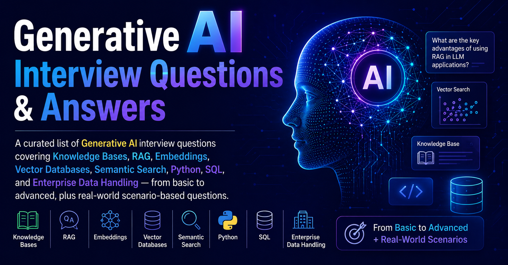

# Generative AI Interview Questions & Answers

  

> A curated list of Generative AI interview questions covering Knowledge Bases, RAG, Embeddings, Vector Databases, Semantic Search, Python, SQL, and Enterprise Data Handling — from basic to advanced, plus real-world scenario-based questions.

---

### Table of Contents

Hide/Show table of contents

| No. | Questions |
| --- | --------- |
|     | **Knowledge Base & Data Preparation** |
| 1 | [What is a Knowledge Base in a GenAI system?](#what-is-a-knowledge-base-in-a-genai-system) |
| 2 | [Why is data preparation important for LLM applications?](#why-is-data-preparation-important-for-llm-applications) |
| 3 | [What types of enterprise documents have you worked with?](#what-types-of-enterprise-documents-have-you-worked-with) |
| 4 | [How do you clean noisy data?](#how-do-you-clean-noisy-data) |
| 5 | [What is data normalization?](#what-is-data-normalization) |
| 6 | [How do you handle duplicate records?](#how-do-you-handle-duplicate-records) |
| 7 | [What is metadata and why is it important?](#what-is-metadata-and-why-is-it-important) |
| 8 | [How would you prepare PDF documents for a chatbot?](#how-would-you-prepare-pdf-documents-for-a-chatbot) |
| 9 | [What challenges arise with scanned PDFs?](#what-challenges-arise-with-scanned-pdfs) |
| 10 | [What is OCR?](#what-is-ocr) |
| 11 | [How would you process documents from SharePoint?](#how-would-you-process-documents-from-sharepoint) |
| 12 | [How do you extract tables from PDFs?](#how-do-you-extract-tables-from-pdfs) |
| 13 | [How do you maintain document versioning?](#how-do-you-maintain-document-versioning) |
| 14 | [How do you identify stale knowledge?](#how-do-you-identify-stale-knowledge) |
| 15 | [How would you handle multilingual documents?](#how-would-you-handle-multilingual-documents) |
| 16 | [What data quality checks do you perform?](#what-data-quality-checks-do-you-perform) |
| 17 | [How do you measure knowledge base completeness?](#how-do-you-measure-knowledge-base-completeness) |
| 18 | [Explain chunking and its importance](#explain-chunking-and-its-importance) |
| 19 | [What chunk size would you choose and why?](#what-chunk-size-would-you-choose-and-why) |
| 20 | [How do you handle document updates in a knowledge base?](#how-do-you-handle-document-updates-in-a-knowledge-base) |
|     | **Retrieval Augmented Generation (RAG)** |
| 21 | [What is RAG?](#what-is-rag) |
| 22 | [Why is RAG preferred over fine-tuning in many cases?](#why-is-rag-preferred-over-fine-tuning-in-many-cases) |
| 23 | [Explain the RAG workflow](#explain-the-rag-workflow) |
| 24 | [What problem does RAG solve?](#what-problem-does-rag-solve) |
| 25 | [What happens if retrieval quality is poor?](#what-happens-if-retrieval-quality-is-poor) |
| 26 | [Describe indexing and retrieval stages](#describe-indexing-and-retrieval-stages) |
| 27 | [What is hybrid search?](#what-is-hybrid-search) |
| 28 | [What is the difference between keyword search and semantic search?](#what-is-the-difference-between-keyword-search-and-semantic-search) |
| 29 | [What is reranking?](#what-is-reranking) |
| 30 | [How do you improve retrieval accuracy?](#how-do-you-improve-retrieval-accuracy) |
| 31 | [What is context window limitation?](#what-is-context-window-limitation) |
| 32 | [How does chunking affect RAG performance?](#how-does-chunking-affect-rag-performance) |
| 33 | [Explain Top-K retrieval](#explain-top-k-retrieval) |
| 34 | [What is context injection?](#what-is-context-injection) |
| 35 | [What are hallucinations and how does RAG reduce them?](#what-are-hallucinations-and-how-does-rag-reduce-them) |
| 36 | [How would you evaluate a RAG system?](#how-would-you-evaluate-a-rag-system) |
| 37 | [What is the difference between Precision and Recall in retrieval?](#what-is-the-difference-between-precision-and-recall-in-retrieval) |
| 38 | [What metrics would you use for RAG evaluation?](#what-metrics-would-you-use-for-rag-evaluation) |
| 39 | [How do you reduce latency in RAG?](#how-do-you-reduce-latency-in-rag) |
| 40 | [What are common failure scenarios in RAG?](#what-are-common-failure-scenarios-in-rag) |
|     | **Embeddings** |
| 41 | [What are embeddings?](#what-are-embeddings) |
| 42 | [Why do we need embeddings?](#why-do-we-need-embeddings) |
| 43 | [Explain vector representation](#explain-vector-representation) |
| 44 | [What is semantic similarity?](#what-is-semantic-similarity) |
| 45 | [How are embeddings generated?](#how-are-embeddings-generated) |
| 46 | [What is the difference between keyword search and embedding search?](#what-is-the-difference-between-keyword-search-and-embedding-search) |
| 47 | [What is cosine similarity?](#what-is-cosine-similarity) |
| 48 | [Why are embeddings high-dimensional vectors?](#why-are-embeddings-high-dimensional-vectors) |
| 49 | [What happens if two documents have similar embeddings?](#what-happens-if-two-documents-have-similar-embeddings) |
| 50 | [Explain Euclidean distance vs cosine similarity](#explain-euclidean-distance-vs-cosine-similarity) |
| 51 | [What embedding models have you used?](#what-embedding-models-have-you-used) |
| 52 | [How do embeddings capture meaning?](#how-do-embeddings-capture-meaning) |
| 53 | [Why might embedding quality vary?](#why-might-embedding-quality-vary) |
| 54 | [How would you evaluate an embedding model?](#how-would-you-evaluate-an-embedding-model) |
| 55 | [What are embedding drift issues?](#what-are-embedding-drift-issues) |
| 56 | [How do domain-specific embeddings help?](#how-do-domain-specific-embeddings-help) |
| 57 | [How would you handle millions of embeddings?](#how-would-you-handle-millions-of-embeddings) |
| 58 | [Explain dimensionality reduction](#explain-dimensionality-reduction) |
| 59 | [What is ANN (Approximate Nearest Neighbor)?](#what-is-ann-approximate-nearest-neighbor) |
| 60 | [How does ANN improve performance?](#how-does-ann-improve-performance) |
|     | **Vector Databases** |
| 61 | [What is a vector database?](#what-is-a-vector-database) |
| 62 | [Why can't traditional SQL databases efficiently handle vector search?](#why-cant-traditional-sql-databases-efficiently-handle-vector-search) |
| 63 | [Name some vector databases](#name-some-vector-databases) |
| 64 | [What is the difference between a vector DB and a relational DB?](#what-is-the-difference-between-a-vector-db-and-a-relational-db) |
| 65 | [What is vector indexing?](#what-is-vector-indexing) |
| 66 | [Explain HNSW indexing](#explain-hnsw-indexing) |
| 67 | [Explain FAISS](#explain-faiss) |
| 68 | [What is Pinecone?](#what-is-pinecone) |
| 69 | [What is ChromaDB?](#what-is-chromadb) |
| 70 | [What is Weaviate?](#what-is-weaviate) |
| 71 | [What is Milvus?](#what-is-milvus) |
| 72 | [How is similarity search performed?](#how-is-similarity-search-performed) |
| 73 | [Explain metadata filtering](#explain-metadata-filtering) |
| 74 | [What is Top-K nearest neighbor search?](#what-is-top-k-nearest-neighbor-search) |
| 75 | [How would you store document metadata?](#how-would-you-store-document-metadata) |
| 76 | [How do vector DBs scale?](#how-do-vector-dbs-scale) |
| 77 | [Explain indexing trade-offs](#explain-indexing-trade-offs) |
| 78 | [How would you handle billions of vectors?](#how-would-you-handle-billions-of-vectors) |
| 79 | [How do you update embeddings when documents change?](#how-do-you-update-embeddings-when-documents-change) |
| 80 | [How would you optimize vector search latency?](#how-would-you-optimize-vector-search-latency) |
|     | **Semantic Search** |
| 81 | [What is semantic search?](#what-is-semantic-search) |
| 82 | [How is semantic search different from keyword search?](#how-is-semantic-search-different-from-keyword-search) |
| 83 | [What problems does semantic search solve?](#what-problems-does-semantic-search-solve) |
| 84 | [Give a practical example of semantic search](#give-a-practical-example-of-semantic-search) |
| 85 | [Explain intent matching](#explain-intent-matching) |
| 86 | [What is query embedding?](#what-is-query-embedding) |
| 87 | [What is document embedding?](#what-is-document-embedding) |
| 88 | [Why can semantic search return relevant results without exact keywords?](#why-can-semantic-search-return-relevant-results-without-exact-keywords) |
| 89 | [What is query expansion?](#what-is-query-expansion) |
| 90 | [How do you improve semantic search relevance?](#how-do-you-improve-semantic-search-relevance) |
| 91 | [How do you evaluate semantic search quality?](#how-do-you-evaluate-semantic-search-quality) |
| 92 | [What role does reranking play?](#what-role-does-reranking-play) |
| 93 | [Explain hybrid search architecture](#explain-hybrid-search-architecture) |
| 94 | [How would you debug poor search results?](#how-would-you-debug-poor-search-results) |
|     | **Python** |
| 95 | [How do you read CSV files using Python?](#how-do-you-read-csv-files-using-python) |
| 96 | [What is the difference between a list and a tuple?](#what-is-the-difference-between-a-list-and-a-tuple) |
| 97 | [Explain dictionaries in Python](#explain-dictionaries-in-python) |
| 98 | [What is Pandas?](#what-is-pandas) |
| 99 | [What is NumPy?](#what-is-numpy) |
| 100 | [How do you handle missing values?](#how-do-you-handle-missing-values) |
| 101 | [How would you clean text data?](#how-would-you-clean-text-data) |
| 102 | [Explain regex](#explain-regex) |
| 103 | [How do you remove stop words?](#how-do-you-remove-stop-words) |
| 104 | [How do you tokenize text?](#how-do-you-tokenize-text) |
| 105 | [What libraries are used in NLP?](#what-libraries-are-used-in-nlp) |
| 106 | [How do you process large files?](#how-do-you-process-large-files) |
| 107 | [Explain generators](#explain-generators) |
| 108 | [What is a DataFrame?](#what-is-a-dataframe) |
| 109 | [Write Python code to remove duplicate rows](#write-python-code-to-remove-duplicate-rows) |
| 110 | [How would you create document chunks?](#how-would-you-create-document-chunks) |
| 111 | [How would you generate embeddings using Python?](#how-would-you-generate-embeddings-using-python) |
| 112 | [How would you call an LLM API?](#how-would-you-call-an-llm-api) |
| 113 | [How would you process 1 million documents efficiently?](#how-would-you-process-1-million-documents-efficiently) |
|     | **SQL** |
| 114 | [What is the difference between WHERE and HAVING?](#what-is-the-difference-between-where-and-having) |
| 115 | [What are joins?](#what-are-joins) |
| 116 | [What is the difference between INNER and LEFT JOIN?](#what-is-the-difference-between-inner-and-left-join) |
| 117 | [What is GROUP BY?](#what-is-group-by) |
| 118 | [What is a primary key?](#what-is-a-primary-key) |
| 119 | [How do you find duplicate records?](#how-do-you-find-duplicate-records) |
| 120 | [Explain window functions](#explain-window-functions) |
| 121 | [What is the difference between ROW_NUMBER and RANK?](#what-is-the-difference-between-rownumber-and-rank) |
| 122 | [What is a CTE?](#what-is-a-cte) |
| 123 | [What are indexes?](#what-are-indexes) |
| 124 | [How do indexes improve performance?](#how-do-indexes-improve-performance) |
| 125 | [Write SQL to find top 5 documents by access count](#write-sql-to-find-top-5-documents-by-access-count) |
| 126 | [How would you identify duplicate KB articles?](#how-would-you-identify-duplicate-kb-articles) |
| 127 | [How would you detect stale documents?](#how-would-you-detect-stale-documents) |
| 128 | [Explain query optimization](#explain-query-optimization) |
| 129 | [What causes full table scans?](#what-causes-full-table-scans) |
|     | **Enterprise Data Handling** |
| 130 | [What is the difference between structured and unstructured data?](#what-is-the-difference-between-structured-and-unstructured-data) |
| 131 | [What are examples of enterprise data sources?](#what-are-examples-of-enterprise-data-sources) |
| 132 | [What challenges exist in enterprise data?](#what-challenges-exist-in-enterprise-data) |
| 133 | [How would you process emails for a knowledge base?](#how-would-you-process-emails-for-a-knowledge-base) |
| 134 | [How would you process Jira tickets?](#how-would-you-process-jira-tickets) |
| 135 | [How would you process Confluence pages?](#how-would-you-process-confluence-pages) |
| 136 | [How would you process SharePoint documents?](#how-would-you-process-sharepoint-documents) |
| 137 | [How would you handle confidential data?](#how-would-you-handle-confidential-data) |
| 138 | [How would you implement data governance?](#how-would-you-implement-data-governance) |
| 139 | [How would you ensure data privacy?](#how-would-you-ensure-data-privacy) |
| 140 | [How would you mask sensitive information?](#how-would-you-mask-sensitive-information) |
| 141 | [How would you build a knowledge base from 10TB of enterprise data?](#how-would-you-build-a-knowledge-base-from-10tb-of-enterprise-data) |
| 142 | [How would you handle access-controlled documents?](#how-would-you-handle-access-controlled-documents) |
|     | **Scenario-Based Questions** |
| 143 | [Users say chatbot answers are irrelevant. How would you investigate?](#users-say-chatbot-answers-are-irrelevant-how-would-you-investigate) |
| 144 | [Retrieval accuracy dropped after a KB update. What would you check?](#retrieval-accuracy-dropped-after-a-kb-update-what-would-you-check) |
| 145 | [Search returns too many unrelated documents. How would you fix it?](#search-returns-too-many-unrelated-documents-how-would-you-fix-it) |
| 146 | [Embedding generation is taking too long. What would you do?](#embedding-generation-is-taking-too-long-what-would-you-do) |
| 147 | [Documents are duplicated across systems. How would you handle it?](#documents-are-duplicated-across-systems-how-would-you-handle-it) |
| 148 | [Chatbot is hallucinating despite RAG. Why?](#chatbot-is-hallucinating-despite-rag-why) |
| 149 | [Vector DB storage costs are increasing. How would you optimize?](#vector-db-storage-costs-are-increasing-how-would-you-optimize) |
| 150 | [How would you design a GenAI knowledge platform for an enterprise with PDFs, SharePoint, Jira, and Confluence?](#how-would-you-design-a-genai-knowledge-platform-for-an-enterprise-with-pdfs-sharepoint-jira-and-confluence) |

## Knowledge Base & Data Preparation

### Basic

1. ### What is a Knowledge Base in a GenAI system?

    <!-- TODO: Add answer -->

    _Answer coming soon..._

    **[⬆ Back to Top](#table-of-contents)**

2. ### Why is data preparation important for LLM applications?

    <!-- TODO: Add answer -->

    _Answer coming soon..._

    **[⬆ Back to Top](#table-of-contents)**

3. ### What types of enterprise documents have you worked with?

    <!-- TODO: Add answer -->

    _Answer coming soon..._

    **[⬆ Back to Top](#table-of-contents)**

4. ### How do you clean noisy data?

    <!-- TODO: Add answer -->

    _Answer coming soon..._

    **[⬆ Back to Top](#table-of-contents)**

5. ### What is data normalization?

    <!-- TODO: Add answer -->

    _Answer coming soon..._

    **[⬆ Back to Top](#table-of-contents)**

6. ### How do you handle duplicate records?

    <!-- TODO: Add answer -->

    _Answer coming soon..._

    **[⬆ Back to Top](#table-of-contents)**

7. ### What is metadata and why is it important?

    <!-- TODO: Add answer -->

    _Answer coming soon..._

    **[⬆ Back to Top](#table-of-contents)**

8. ### How would you prepare PDF documents for a chatbot?

    <!-- TODO: Add answer -->

    _Answer coming soon..._

    **[⬆ Back to Top](#table-of-contents)**

9. ### What challenges arise with scanned PDFs?

    <!-- TODO: Add answer -->

    _Answer coming soon..._

    **[⬆ Back to Top](#table-of-contents)**

10. ### What is OCR?

    <!-- TODO: Add answer -->

    _Answer coming soon..._

    **[⬆ Back to Top](#table-of-contents)**

### Intermediate

11. ### How would you process documents from SharePoint?

    <!-- TODO: Add answer -->

    _Answer coming soon..._

    **[⬆ Back to Top](#table-of-contents)**

12. ### How do you extract tables from PDFs?

    <!-- TODO: Add answer -->

    _Answer coming soon..._

    **[⬆ Back to Top](#table-of-contents)**

13. ### How do you maintain document versioning?

    <!-- TODO: Add answer -->

    _Answer coming soon..._

    **[⬆ Back to Top](#table-of-contents)**

14. ### How do you identify stale knowledge?

    <!-- TODO: Add answer -->

    _Answer coming soon..._

    **[⬆ Back to Top](#table-of-contents)**

15. ### How would you handle multilingual documents?

    <!-- TODO: Add answer -->

    _Answer coming soon..._

    **[⬆ Back to Top](#table-of-contents)**

16. ### What data quality checks do you perform?

    <!-- TODO: Add answer -->

    _Answer coming soon..._

    **[⬆ Back to Top](#table-of-contents)**

17. ### How do you measure knowledge base completeness?

    <!-- TODO: Add answer -->

    _Answer coming soon..._

    **[⬆ Back to Top](#table-of-contents)**

18. ### Explain chunking and its importance

    <!-- TODO: Add answer -->

    _Answer coming soon..._

    **[⬆ Back to Top](#table-of-contents)**

19. ### What chunk size would you choose and why?

    <!-- TODO: Add answer -->

    _Answer coming soon..._

    **[⬆ Back to Top](#table-of-contents)**

20. ### How do you handle document updates in a knowledge base?

    <!-- TODO: Add answer -->

    _Answer coming soon..._

    **[⬆ Back to Top](#table-of-contents)**

## Retrieval Augmented Generation (RAG)

### Basic

21. ### What is RAG?

    <!-- TODO: Add answer -->

    _Answer coming soon..._

    **[⬆ Back to Top](#table-of-contents)**

22. ### Why is RAG preferred over fine-tuning in many cases?

    <!-- TODO: Add answer -->

    _Answer coming soon..._

    **[⬆ Back to Top](#table-of-contents)**

23. ### Explain the RAG workflow

    <!-- TODO: Add answer -->

    _Answer coming soon..._

    **[⬆ Back to Top](#table-of-contents)**

24. ### What problem does RAG solve?

    <!-- TODO: Add answer -->

    _Answer coming soon..._

    **[⬆ Back to Top](#table-of-contents)**

25. ### What happens if retrieval quality is poor?

    <!-- TODO: Add answer -->

    _Answer coming soon..._

    **[⬆ Back to Top](#table-of-contents)**

### Intermediate

26. ### Describe indexing and retrieval stages

    <!-- TODO: Add answer -->

    _Answer coming soon..._

    **[⬆ Back to Top](#table-of-contents)**

27. ### What is hybrid search?

    <!-- TODO: Add answer -->

    _Answer coming soon..._

    **[⬆ Back to Top](#table-of-contents)**

28. ### What is the difference between keyword search and semantic search?

    <!-- TODO: Add answer -->

    _Answer coming soon..._

    **[⬆ Back to Top](#table-of-contents)**

29. ### What is reranking?

    <!-- TODO: Add answer -->

    _Answer coming soon..._

    **[⬆ Back to Top](#table-of-contents)**

30. ### How do you improve retrieval accuracy?

    <!-- TODO: Add answer -->

    _Answer coming soon..._

    **[⬆ Back to Top](#table-of-contents)**

31. ### What is context window limitation?

    <!-- TODO: Add answer -->

    _Answer coming soon..._

    **[⬆ Back to Top](#table-of-contents)**

32. ### How does chunking affect RAG performance?

    <!-- TODO: Add answer -->

    _Answer coming soon..._

    **[⬆ Back to Top](#table-of-contents)**

33. ### Explain Top-K retrieval

    <!-- TODO: Add answer -->

    _Answer coming soon..._

    **[⬆ Back to Top](#table-of-contents)**

34. ### What is context injection?

    <!-- TODO: Add answer -->

    _Answer coming soon..._

    **[⬆ Back to Top](#table-of-contents)**

35. ### What are hallucinations and how does RAG reduce them?

    <!-- TODO: Add answer -->

    _Answer coming soon..._

    **[⬆ Back to Top](#table-of-contents)**

### Advanced

36. ### How would you evaluate a RAG system?

    <!-- TODO: Add answer -->

    _Answer coming soon..._

    **[⬆ Back to Top](#table-of-contents)**

37. ### What is the difference between Precision and Recall in retrieval?

    <!-- TODO: Add answer -->

    _Answer coming soon..._

    **[⬆ Back to Top](#table-of-contents)**

38. ### What metrics would you use for RAG evaluation?

    <!-- TODO: Add answer -->

    _Answer coming soon..._

    **[⬆ Back to Top](#table-of-contents)**

39. ### How do you reduce latency in RAG?

    <!-- TODO: Add answer -->

    _Answer coming soon..._

    **[⬆ Back to Top](#table-of-contents)**

40. ### What are common failure scenarios in RAG?

    <!-- TODO: Add answer -->

    _Answer coming soon..._

    **[⬆ Back to Top](#table-of-contents)**

## Embeddings

### Basic

41. ### What are embeddings?

    <!-- TODO: Add answer -->

    _Answer coming soon..._

    **[⬆ Back to Top](#table-of-contents)**

42. ### Why do we need embeddings?

    <!-- TODO: Add answer -->

    _Answer coming soon..._

    **[⬆ Back to Top](#table-of-contents)**

43. ### Explain vector representation

    <!-- TODO: Add answer -->

    _Answer coming soon..._

    **[⬆ Back to Top](#table-of-contents)**

44. ### What is semantic similarity?

    <!-- TODO: Add answer -->

    _Answer coming soon..._

    **[⬆ Back to Top](#table-of-contents)**

45. ### How are embeddings generated?

    <!-- TODO: Add answer -->

    _Answer coming soon..._

    **[⬆ Back to Top](#table-of-contents)**

### Intermediate

46. ### What is the difference between keyword search and embedding search?

    <!-- TODO: Add answer -->

    _Answer coming soon..._

    **[⬆ Back to Top](#table-of-contents)**

47. ### What is cosine similarity?

    <!-- TODO: Add answer -->

    _Answer coming soon..._

    **[⬆ Back to Top](#table-of-contents)**

48. ### Why are embeddings high-dimensional vectors?

    <!-- TODO: Add answer -->

    _Answer coming soon..._

    **[⬆ Back to Top](#table-of-contents)**

49. ### What happens if two documents have similar embeddings?

    <!-- TODO: Add answer -->

    _Answer coming soon..._

    **[⬆ Back to Top](#table-of-contents)**

50. ### Explain Euclidean distance vs cosine similarity

    <!-- TODO: Add answer -->

    _Answer coming soon..._

    **[⬆ Back to Top](#table-of-contents)**

51. ### What embedding models have you used?

    <!-- TODO: Add answer -->

    _Answer coming soon..._

    **[⬆ Back to Top](#table-of-contents)**

52. ### How do embeddings capture meaning?

    <!-- TODO: Add answer -->

    _Answer coming soon..._

    **[⬆ Back to Top](#table-of-contents)**

53. ### Why might embedding quality vary?

    <!-- TODO: Add answer -->

    _Answer coming soon..._

    **[⬆ Back to Top](#table-of-contents)**

### Advanced

54. ### How would you evaluate an embedding model?

    <!-- TODO: Add answer -->

    _Answer coming soon..._

    **[⬆ Back to Top](#table-of-contents)**

55. ### What are embedding drift issues?

    <!-- TODO: Add answer -->

    _Answer coming soon..._

    **[⬆ Back to Top](#table-of-contents)**

56. ### How do domain-specific embeddings help?

    <!-- TODO: Add answer -->

    _Answer coming soon..._

    **[⬆ Back to Top](#table-of-contents)**

57. ### How would you handle millions of embeddings?

    <!-- TODO: Add answer -->

    _Answer coming soon..._

    **[⬆ Back to Top](#table-of-contents)**

58. ### Explain dimensionality reduction

    <!-- TODO: Add answer -->

    _Answer coming soon..._

    **[⬆ Back to Top](#table-of-contents)**

59. ### What is ANN (Approximate Nearest Neighbor)?

    <!-- TODO: Add answer -->

    _Answer coming soon..._

    **[⬆ Back to Top](#table-of-contents)**

60. ### How does ANN improve performance?

    <!-- TODO: Add answer -->

    _Answer coming soon..._

    **[⬆ Back to Top](#table-of-contents)**

## Vector Databases

### Basic

61. ### What is a vector database?

    <!-- TODO: Add answer -->

    _Answer coming soon..._

    **[⬆ Back to Top](#table-of-contents)**

62. ### Why can't traditional SQL databases efficiently handle vector search?

    <!-- TODO: Add answer -->

    _Answer coming soon..._

    **[⬆ Back to Top](#table-of-contents)**

63. ### Name some vector databases

    <!-- TODO: Add answer -->

    _Answer coming soon..._

    **[⬆ Back to Top](#table-of-contents)**

64. ### What is the difference between a vector DB and a relational DB?

    <!-- TODO: Add answer -->

    _Answer coming soon..._

    **[⬆ Back to Top](#table-of-contents)**

65. ### What is vector indexing?

    <!-- TODO: Add answer -->

    _Answer coming soon..._

    **[⬆ Back to Top](#table-of-contents)**

### Intermediate

66. ### Explain HNSW indexing

    <!-- TODO: Add answer -->

    _Answer coming soon..._

    **[⬆ Back to Top](#table-of-contents)**

67. ### Explain FAISS

    <!-- TODO: Add answer -->

    _Answer coming soon..._

    **[⬆ Back to Top](#table-of-contents)**

68. ### What is Pinecone?

    <!-- TODO: Add answer -->

    _Answer coming soon..._

    **[⬆ Back to Top](#table-of-contents)**

69. ### What is ChromaDB?

    <!-- TODO: Add answer -->

    _Answer coming soon..._

    **[⬆ Back to Top](#table-of-contents)**

70. ### What is Weaviate?

    <!-- TODO: Add answer -->

    _Answer coming soon..._

    **[⬆ Back to Top](#table-of-contents)**

71. ### What is Milvus?

    <!-- TODO: Add answer -->

    _Answer coming soon..._

    **[⬆ Back to Top](#table-of-contents)**

72. ### How is similarity search performed?

    <!-- TODO: Add answer -->

    _Answer coming soon..._

    **[⬆ Back to Top](#table-of-contents)**

73. ### Explain metadata filtering

    <!-- TODO: Add answer -->

    _Answer coming soon..._

    **[⬆ Back to Top](#table-of-contents)**

74. ### What is Top-K nearest neighbor search?

    <!-- TODO: Add answer -->

    _Answer coming soon..._

    **[⬆ Back to Top](#table-of-contents)**

75. ### How would you store document metadata?

    <!-- TODO: Add answer -->

    _Answer coming soon..._

    **[⬆ Back to Top](#table-of-contents)**

### Advanced

76. ### How do vector DBs scale?

    <!-- TODO: Add answer -->

    _Answer coming soon..._

    **[⬆ Back to Top](#table-of-contents)**

77. ### Explain indexing trade-offs

    <!-- TODO: Add answer -->

    _Answer coming soon..._

    **[⬆ Back to Top](#table-of-contents)**

78. ### How would you handle billions of vectors?

    <!-- TODO: Add answer -->

    _Answer coming soon..._

    **[⬆ Back to Top](#table-of-contents)**

79. ### How do you update embeddings when documents change?

    <!-- TODO: Add answer -->

    _Answer coming soon..._

    **[⬆ Back to Top](#table-of-contents)**

80. ### How would you optimize vector search latency?

    <!-- TODO: Add answer -->

    _Answer coming soon..._

    **[⬆ Back to Top](#table-of-contents)**

## Semantic Search

### Basic

81. ### What is semantic search?

    <!-- TODO: Add answer -->

    _Answer coming soon..._

    **[⬆ Back to Top](#table-of-contents)**

82. ### How is semantic search different from keyword search?

    <!-- TODO: Add answer -->

    _Answer coming soon..._

    **[⬆ Back to Top](#table-of-contents)**

83. ### What problems does semantic search solve?

    <!-- TODO: Add answer -->

    _Answer coming soon..._

    **[⬆ Back to Top](#table-of-contents)**

84. ### Give a practical example of semantic search

    <!-- TODO: Add answer -->

    _Answer coming soon..._

    **[⬆ Back to Top](#table-of-contents)**

### Intermediate

85. ### Explain intent matching

    <!-- TODO: Add answer -->

    _Answer coming soon..._

    **[⬆ Back to Top](#table-of-contents)**

86. ### What is query embedding?

    <!-- TODO: Add answer -->

    _Answer coming soon..._

    **[⬆ Back to Top](#table-of-contents)**

87. ### What is document embedding?

    <!-- TODO: Add answer -->

    _Answer coming soon..._

    **[⬆ Back to Top](#table-of-contents)**

88. ### Why can semantic search return relevant results without exact keywords?

    <!-- TODO: Add answer -->

    _Answer coming soon..._

    **[⬆ Back to Top](#table-of-contents)**

89. ### What is query expansion?

    <!-- TODO: Add answer -->

    _Answer coming soon..._

    **[⬆ Back to Top](#table-of-contents)**

### Advanced

90. ### How do you improve semantic search relevance?

    <!-- TODO: Add answer -->

    _Answer coming soon..._

    **[⬆ Back to Top](#table-of-contents)**

91. ### How do you evaluate semantic search quality?

    <!-- TODO: Add answer -->

    _Answer coming soon..._

    **[⬆ Back to Top](#table-of-contents)**

92. ### What role does reranking play?

    <!-- TODO: Add answer -->

    _Answer coming soon..._

    **[⬆ Back to Top](#table-of-contents)**

93. ### Explain hybrid search architecture

    <!-- TODO: Add answer -->

    _Answer coming soon..._

    **[⬆ Back to Top](#table-of-contents)**

94. ### How would you debug poor search results?

    <!-- TODO: Add answer -->

    _Answer coming soon..._

    **[⬆ Back to Top](#table-of-contents)**

## Python

### Basic

95. ### How do you read CSV files using Python?

    <!-- TODO: Add answer -->

    _Answer coming soon..._

    **[⬆ Back to Top](#table-of-contents)**

96. ### What is the difference between a list and a tuple?

    <!-- TODO: Add answer -->

    _Answer coming soon..._

    **[⬆ Back to Top](#table-of-contents)**

97. ### Explain dictionaries in Python

    <!-- TODO: Add answer -->

    _Answer coming soon..._

    **[⬆ Back to Top](#table-of-contents)**

98. ### What is Pandas?

    <!-- TODO: Add answer -->

    _Answer coming soon..._

    **[⬆ Back to Top](#table-of-contents)**

99. ### What is NumPy?

    <!-- TODO: Add answer -->

    _Answer coming soon..._

    **[⬆ Back to Top](#table-of-contents)**

100. ### How do you handle missing values?

    <!-- TODO: Add answer -->

    _Answer coming soon..._

    **[⬆ Back to Top](#table-of-contents)**

### Intermediate

101. ### How would you clean text data?

    <!-- TODO: Add answer -->

    _Answer coming soon..._

    **[⬆ Back to Top](#table-of-contents)**

102. ### Explain regex

    <!-- TODO: Add answer -->

    _Answer coming soon..._

    **[⬆ Back to Top](#table-of-contents)**

103. ### How do you remove stop words?

    <!-- TODO: Add answer -->

    _Answer coming soon..._

    **[⬆ Back to Top](#table-of-contents)**

104. ### How do you tokenize text?

    <!-- TODO: Add answer -->

    _Answer coming soon..._

    **[⬆ Back to Top](#table-of-contents)**

105. ### What libraries are used in NLP?

    <!-- TODO: Add answer -->

    _Answer coming soon..._

    **[⬆ Back to Top](#table-of-contents)**

106. ### How do you process large files?

    <!-- TODO: Add answer -->

    _Answer coming soon..._

    **[⬆ Back to Top](#table-of-contents)**

107. ### Explain generators

    <!-- TODO: Add answer -->

    _Answer coming soon..._

    **[⬆ Back to Top](#table-of-contents)**

108. ### What is a DataFrame?

    <!-- TODO: Add answer -->

    _Answer coming soon..._

    **[⬆ Back to Top](#table-of-contents)**

### Advanced

109. ### Write Python code to remove duplicate rows

    <!-- TODO: Add answer -->

    _Answer coming soon..._

    **[⬆ Back to Top](#table-of-contents)**

110. ### How would you create document chunks?

    <!-- TODO: Add answer -->

    _Answer coming soon..._

    **[⬆ Back to Top](#table-of-contents)**

111. ### How would you generate embeddings using Python?

    <!-- TODO: Add answer -->

    _Answer coming soon..._

    **[⬆ Back to Top](#table-of-contents)**

112. ### How would you call an LLM API?

    <!-- TODO: Add answer -->

    _Answer coming soon..._

    **[⬆ Back to Top](#table-of-contents)**

113. ### How would you process 1 million documents efficiently?

    <!-- TODO: Add answer -->

    _Answer coming soon..._

    **[⬆ Back to Top](#table-of-contents)**

## SQL

### Basic

114. ### What is the difference between WHERE and HAVING?

    <!-- TODO: Add answer -->

    _Answer coming soon..._

    **[⬆ Back to Top](#table-of-contents)**

115. ### What are joins?

    <!-- TODO: Add answer -->

    _Answer coming soon..._

    **[⬆ Back to Top](#table-of-contents)**

116. ### What is the difference between INNER and LEFT JOIN?

    <!-- TODO: Add answer -->

    _Answer coming soon..._

    **[⬆ Back to Top](#table-of-contents)**

117. ### What is GROUP BY?

    <!-- TODO: Add answer -->

    _Answer coming soon..._

    **[⬆ Back to Top](#table-of-contents)**

118. ### What is a primary key?

    <!-- TODO: Add answer -->

    _Answer coming soon..._

    **[⬆ Back to Top](#table-of-contents)**

### Intermediate

119. ### How do you find duplicate records?

    <!-- TODO: Add answer -->

    _Answer coming soon..._

    **[⬆ Back to Top](#table-of-contents)**

120. ### Explain window functions

    <!-- TODO: Add answer -->

    _Answer coming soon..._

    **[⬆ Back to Top](#table-of-contents)**

121. ### What is the difference between ROW_NUMBER and RANK?

    <!-- TODO: Add answer -->

    _Answer coming soon..._

    **[⬆ Back to Top](#table-of-contents)**

122. ### What is a CTE?

    <!-- TODO: Add answer -->

    _Answer coming soon..._

    **[⬆ Back to Top](#table-of-contents)**

123. ### What are indexes?

    <!-- TODO: Add answer -->

    _Answer coming soon..._

    **[⬆ Back to Top](#table-of-contents)**

124. ### How do indexes improve performance?

    <!-- TODO: Add answer -->

    _Answer coming soon..._

    **[⬆ Back to Top](#table-of-contents)**

### Advanced

125. ### Write SQL to find top 5 documents by access count

    <!-- TODO: Add answer -->

    _Answer coming soon..._

    **[⬆ Back to Top](#table-of-contents)**

126. ### How would you identify duplicate KB articles?

    <!-- TODO: Add answer -->

    _Answer coming soon..._

    **[⬆ Back to Top](#table-of-contents)**

127. ### How would you detect stale documents?

    <!-- TODO: Add answer -->

    _Answer coming soon..._

    **[⬆ Back to Top](#table-of-contents)**

128. ### Explain query optimization

    <!-- TODO: Add answer -->

    _Answer coming soon..._

    **[⬆ Back to Top](#table-of-contents)**

129. ### What causes full table scans?

    <!-- TODO: Add answer -->

    _Answer coming soon..._

    **[⬆ Back to Top](#table-of-contents)**

## Enterprise Data Handling

### Basic

130. ### What is the difference between structured and unstructured data?

    <!-- TODO: Add answer -->

    _Answer coming soon..._

    **[⬆ Back to Top](#table-of-contents)**

131. ### What are examples of enterprise data sources?

    <!-- TODO: Add answer -->

    _Answer coming soon..._

    **[⬆ Back to Top](#table-of-contents)**

132. ### What challenges exist in enterprise data?

    <!-- TODO: Add answer -->

    _Answer coming soon..._

    **[⬆ Back to Top](#table-of-contents)**

### Intermediate

133. ### How would you process emails for a knowledge base?

    <!-- TODO: Add answer -->

    _Answer coming soon..._

    **[⬆ Back to Top](#table-of-contents)**

134. ### How would you process Jira tickets?

    <!-- TODO: Add answer -->

    _Answer coming soon..._

    **[⬆ Back to Top](#table-of-contents)**

135. ### How would you process Confluence pages?

    <!-- TODO: Add answer -->

    _Answer coming soon..._

    **[⬆ Back to Top](#table-of-contents)**

136. ### How would you process SharePoint documents?

    <!-- TODO: Add answer -->

    _Answer coming soon..._

    **[⬆ Back to Top](#table-of-contents)**

137. ### How would you handle confidential data?

    <!-- TODO: Add answer -->

    _Answer coming soon..._

    **[⬆ Back to Top](#table-of-contents)**

### Advanced

138. ### How would you implement data governance?

    <!-- TODO: Add answer -->

    _Answer coming soon..._

    **[⬆ Back to Top](#table-of-contents)**

139. ### How would you ensure data privacy?

    <!-- TODO: Add answer -->

    _Answer coming soon..._

    **[⬆ Back to Top](#table-of-contents)**

140. ### How would you mask sensitive information?

    <!-- TODO: Add answer -->

    _Answer coming soon..._

    **[⬆ Back to Top](#table-of-contents)**

141. ### How would you build a knowledge base from 10TB of enterprise data?

    <!-- TODO: Add answer -->

    _Answer coming soon..._

    **[⬆ Back to Top](#table-of-contents)**

142. ### How would you handle access-controlled documents?

    <!-- TODO: Add answer -->

    _Answer coming soon..._

    **[⬆ Back to Top](#table-of-contents)**

## Scenario-Based Questions

143. ### Users say chatbot answers are irrelevant. How would you investigate?

    <!-- TODO: Add answer -->

    _Answer coming soon..._

    **[⬆ Back to Top](#table-of-contents)**

144. ### Retrieval accuracy dropped after a KB update. What would you check?

    <!-- TODO: Add answer -->

    _Answer coming soon..._

    **[⬆ Back to Top](#table-of-contents)**

145. ### Search returns too many unrelated documents. How would you fix it?

    <!-- TODO: Add answer -->

    _Answer coming soon..._

    **[⬆ Back to Top](#table-of-contents)**

146. ### Embedding generation is taking too long. What would you do?

    <!-- TODO: Add answer -->

    _Answer coming soon..._

    **[⬆ Back to Top](#table-of-contents)**

147. ### Documents are duplicated across systems. How would you handle it?

    <!-- TODO: Add answer -->

    _Answer coming soon..._

    **[⬆ Back to Top](#table-of-contents)**

148. ### Chatbot is hallucinating despite RAG. Why?

    <!-- TODO: Add answer -->

    _Answer coming soon..._

    **[⬆ Back to Top](#table-of-contents)**

149. ### Vector DB storage costs are increasing. How would you optimize?

    <!-- TODO: Add answer -->

    _Answer coming soon..._

    **[⬆ Back to Top](#table-of-contents)**

150. ### How would you design a GenAI knowledge platform for an enterprise with PDFs, SharePoint, Jira, and Confluence?

    <!-- TODO: Add answer -->

    _Answer coming soon..._

    **[⬆ Back to Top](#table-of-contents)**

---

### Disclaimer

The questions provided in this repository are a summary of frequently asked questions for Generative AI engineering roles. There is no guarantee these exact questions will be asked in interviews — the purpose of this list is to help you quickly cover the key concepts. Answers will be added progressively; contributions are welcome.

Good luck with your interview 😊

---
